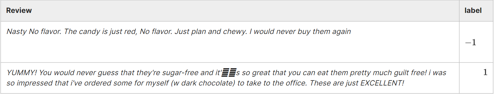

# Automatic Review Analyzer

The goal of this project is to design a classifier to use for sentiment analysis of product reviews. Our training set consists of reviews written by Amazon customers for various food products. The reviews, originally given on a 5 point scale, have been adjusted to a +1 or -1 scale, representing a positive or negative review, respectively.

In order to automatically analyze reviews, we will need to complete the following tasks:

-Implement and compare three types of linear classifiers: the perceptron algorithm, the average perceptron algorithm, and the Pegasos algorithm.

-Use your classifiers on the food review dataset, using some simple text features.

-Experiment with additional features and explore their impact on classifier performance.

Setup Details:

For this project we will be using Python 3.6 with some additional libraries. We strongly recommend that you take note of how the NumPy numerical library is used in the code provided. NumPy arrays are much more efficient than Python's native arrays when doing numerical computation. In addition, using NumPy will substantially reduce the lines of code you will need to write.

Note on software: For this project, we will need the NumPy numerical toolbox, and the matplotlib plotting toolbox.
